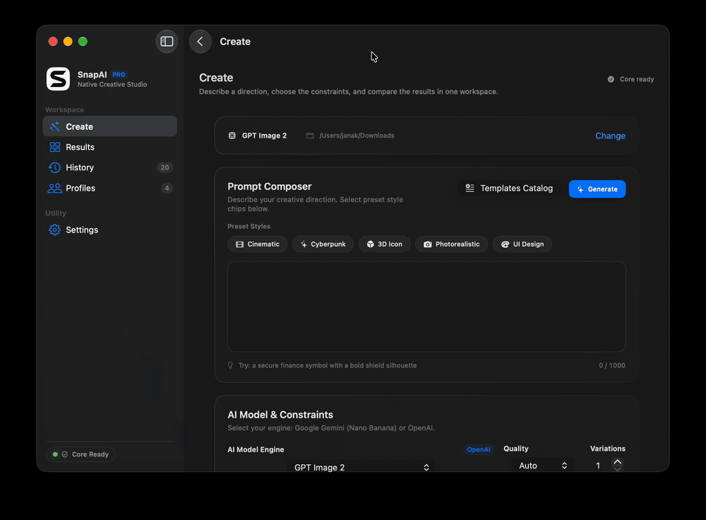

# SnapAI

SnapAI is a local-first image-generation tool for app artwork and visual directions. It supports OpenAI and Google Gemini through a shared TypeScript generation core, with three developer entry points and a native SwiftUI macOS app.



## What is included

- **Native macOS app** — guided setup, secure provider credentials, prompt templates, model selection, prompt preview, output-folder control, generation results, profiles, history, Quick Look, and Finder actions. The Create workspace has one primary **Generate** action in the prompt composer.
- **`icon` CLI** — scripting-friendly image generation.
- **`ui` browser UI** — local prompts, previews, generation, profiles, and history.
- **`studio` terminal workflow** — interactive prompts, profiles, confirmations, reruns, and history.

The macOS app and browser UI use the same local TypeScript core, so prompt and generation behavior stays consistent across surfaces.

## Upstream project and attribution

This repository is based on [SnapAI by Code with Beto](https://github.com/betomoedano/snapai). The original project provides the TypeScript generation core, CLI, browser UI, and prompt-generation foundations. This repository extends that work with the native SwiftUI macOS app and its packaging workflow.

The upstream project is licensed under the MIT License. Its copyright notice is preserved in [LICENSE](LICENSE).

## Requirements

For the native app:

- macOS 14 Sonoma or newer
- Node.js 18 or newer
- pnpm
- Swift toolchain / Xcode command-line tools
- An OpenAI API key and/or Google Gemini API key

For the CLI, browser UI, and Studio, Node.js 18+, pnpm, and a configured provider key are required.

## Native macOS app

### Build and launch

From the repository root:

```bash
pnpm install
pnpm run build
pnpm run macos:build
open -n ./macos/SnapAIApp/SnapAI.app
```

`macos:build` creates an ad-hoc-signed app bundle at `macos/SnapAIApp/SnapAI.app`. The bundle includes the compiled TypeScript core, production dependencies, and a Node runtime, so the normal launch path does not require a separate Node installation after the bundle has been built.

To validate the sandboxed release path:

```bash
SNAPAI_ENABLE_SANDBOX=1 pnpm run macos:build
open -n ./macos/SnapAIApp/SnapAI.app
```

For diagnostics against the source checkout:

```bash
SNAPAI_CORE_ROOT="$PWD" \
  ./macos/SnapAIApp/SnapAI.app/Contents/MacOS/SnapAIApp
```

### First launch

1. Continue through the welcome screen.
2. Save an OpenAI key or optionally configure Google Gemini. Keys are stored in macOS Keychain.
3. Choose the default folder where generated files should be saved.
4. Select **Start creating**.
5. Enter a prompt, choose a model and options, then select **Generate**.

The app remembers onboarding, profiles, history, and the selected output folder between launches. A folder can also be changed for an individual run from the Create screen.

### Generation workflow

From **Create**, you can:

- Start with a prompt template and edit it freely.
- Preview the resolved prompt before making a provider request.
- Choose among the available OpenAI and Gemini image models.
- Adjust quality, variations, background, output format, style, and filename options where supported.
- Select **Generate** in the prompt composer to start a request. While it runs, the button shows its active generation state; use the request status card to cancel or retry.
- Save results as square image files in the selected folder. You can set a different folder for an individual run without changing the default.
- Inspect results in the app, open or reveal them in Finder, use Quick Look, copy paths, and drag result files into other Mac apps.

The sidebar also provides **Results**, **History**, **Profiles**, and **Settings**. Profiles save reusable prompt options; history stores generation metadata and output paths without storing provider credentials.

### Build a distributable DMG

The repository also includes Apple Silicon (macOS 14+) release tooling that Developer ID-signs, notarizes, and staples a drag-to-install DMG. You need a paid Apple Developer membership, a **Developer ID Application** certificate, and an App Store Connect API key with permission to use the notarization service.

Store notarization credentials in your keychain once per signing machine:

```bash
cd macos/SnapAIApp
SNAPAI_NOTARY_KEY_ID=<key-id> \
SNAPAI_NOTARY_ISSUER=<issuer-id> \
SNAPAI_NOTARY_KEY_PATH=<path-to-AuthKey.p8> \
  ./setup-notary.sh
```

Then create the release image:

```bash
SNAPAI_SIGN_IDENTITY="Developer ID Application: Your Name (TEAMID)" \
  ./make-dmg.sh
```

The final file is `macos/SnapAIApp/SnapAI-<version>.dmg`. For detailed prerequisites and release-script options, see [the macOS app README](macos/SnapAIApp/README.md).

### Native app models

| App option | Provider |
| --- | --- |
| GPT Image 2 | OpenAI |
| GPT Image 1.5 | OpenAI |
| GPT Image 1 | OpenAI |
| Nano Banana 2 | Google Gemini |
| Nano Banana | Google Gemini |
| Nano Banana Pro | Google Gemini |

## Security and local data

- Provider keys are stored in macOS Keychain under the app service; they are not written to native JSON state or generation history.
- The native app sends credentials only for the selected provider and only for the generation request.
- The embedded core listens on `127.0.0.1` using a random per-launch bearer token.
- Generated files are written only to a folder selected by the user. macOS security-scoped bookmarks allow the app to restore that permission.
- The local file endpoint serves only output paths recorded in generation history; it does not expose arbitrary filesystem paths.
- Native profiles and history are stored under `~/Library/Application Support/SnapAI`.
- CLI and browser-core configuration and runtime data are stored under `~/.snapai` when persistent configuration is used.

Do not commit `.env` files, API keys, Keychain exports, generated images, or runtime directories.

## API keys

For a temporary shell session:

```bash
export OPENAI_API_KEY="sk-..."
export GEMINI_API_KEY="..."
```

SnapAI also accepts `SNAPAI_API_KEY` and `SNAPAI_GOOGLE_API_KEY`.

To persist CLI/browser configuration locally in `~/.snapai/config.json`:

```bash
node bin/dev.js config --openai-api-key "sk-..."
node bin/dev.js config --google-api-key "..."
node bin/dev.js config --show
```

The native macOS app does not require these environment variables for normal use; enter provider credentials through the app so they are stored in Keychain.

## Browser UI

Build the TypeScript core, then start the local UI:

```bash
pnpm run build
node bin/dev.js ui
```

The UI listens on `http://127.0.0.1:4173` and attempts to open a browser.

```bash
node bin/dev.js ui --no-open
node bin/dev.js ui --port 4190
```

The browser UI provides setup and health checks, prompt preview, generation, result metadata, history, and profile management. Generated files are written to the selected output directory.

## Studio TUI

```bash
node bin/dev.js studio
node bin/dev.js studio --prompt "minimal weather artwork"
node bin/dev.js studio --model banana
node bin/dev.js studio --profile "my profile"
```

Studio supports profile-aware defaults, option overrides, confirmation before generation, reruns, prompt editing, and recent history.

## CLI

Generate an icon with the default OpenAI model:

```bash
node bin/dev.js icon --prompt "minimal weather app with sun and cloud"
```

Available model aliases:

| Alias | Provider/model |
| --- | --- |
| `gpt-1.5` | OpenAI `gpt-image-1.5` |
| `gpt-1` | OpenAI `gpt-image-1` |
| `gpt-image-2` | OpenAI GPT Image 2 |
| `banana` | Gemini Nano Banana |
| `banana-2` | Gemini Nano Banana 2 |
| `banana-pro` | Gemini Nano Banana Pro |

Examples:

```bash
# Save to a custom directory
node bin/dev.js icon --prompt "secure finance symbol" --output ./assets/icons

# Generate multiple OpenAI variations
node bin/dev.js icon --prompt "abstract music symbol" --model gpt-1.5 -n 3

# Use GPT Image 2
node bin/dev.js icon --prompt "soft 3D star" --model gpt-image-2

# Use Nano Banana 2
node bin/dev.js icon --prompt "friendly weather symbol" --model banana-2 --thinking max

# Preview the final prompt without making an API request
node bin/dev.js icon --prompt "calculator symbol" --style minimalism --prompt-only
```

Generated CLI images are square `1024x1024` outputs. Use `node bin/dev.js icon --help` for the complete flag reference.

## Development and tests

```bash
pnpm run build
pnpm run macos:test
pnpm run lint
```

The native macOS suite currently passes all tests. The TypeScript Jest command is available as `pnpm test`, but this checkout currently has no discovered JavaScript test files. Lint reports the existing intentional `while (true)` input loops in `src/commands/studio.ts`; those do not prevent the project from building or running.

Watch TypeScript while working:

```bash
pnpm run dev
```

The native app is an SPM package under `macos/SnapAIApp`. Its local core is authenticated loopback HTTP rather than a Unix socket so the embedded Node runtime remains compatible with the macOS app sandbox and the existing browser/development surface.
